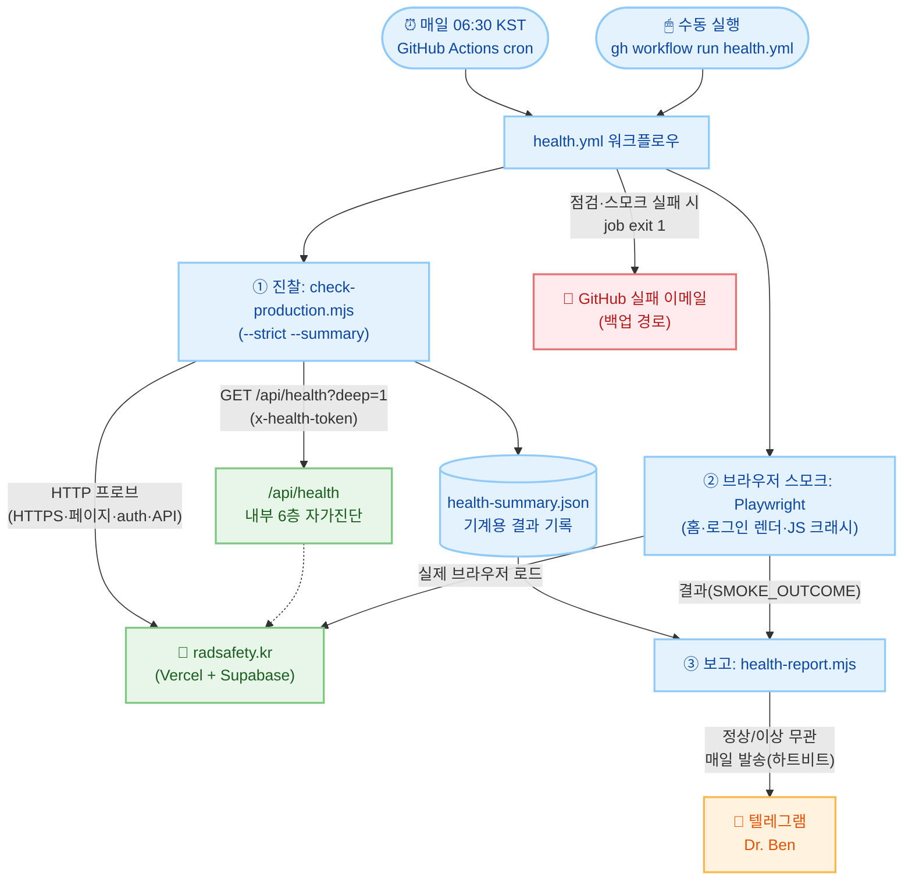
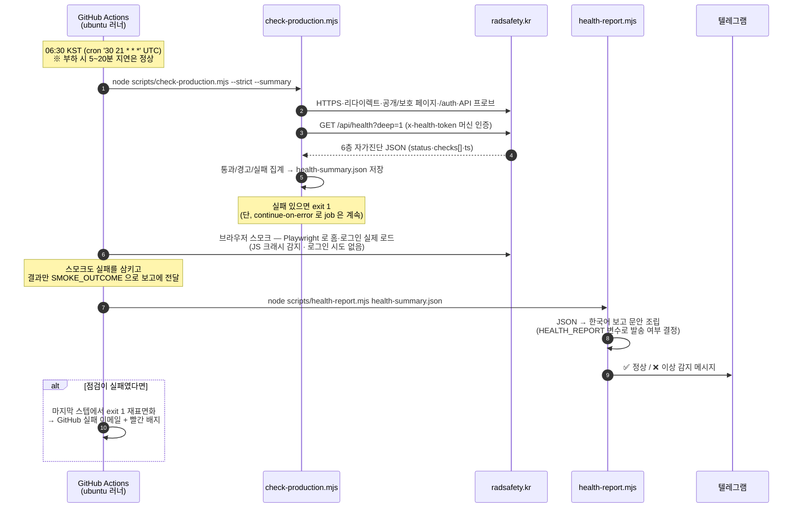
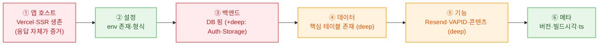
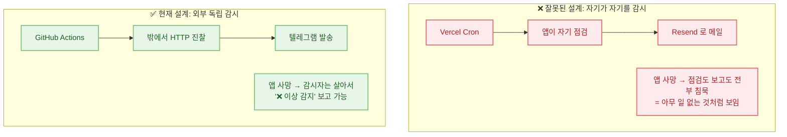

# 아침 헬스체크·텔레그램 보고 개념 가이드

> 이 문서는 **매일 아침 06:30(KST) 앱 전체의 정상작동을 자동 점검하여 텔레그램으로 보고하는 시스템**이 어떤 개념으로 설계·구현되었는지 설명합니다. 운영 명령어 치트시트는 [AGENTS.md §5](../AGENTS.md)에, 파일별 상세 명세는 `.spec/` 에 있으며, 이 문서는 **"왜 이렇게 만들었는가"의 큰 그림**을 담당합니다.

---

## 1. 한 문장 요약

**GitHub Actions 가 매일 아침 병원 밖(외부)에서 환자(radsafety.kr)를 진찰하고, 그 결과를 앱과 무관한 채널(텔레그램)로 보고한다. 정상이어도 매일 한 통을 보내, "조용함 = 정상"이라는 착각을 원천 차단한다.**

---

## 2. 전체 구조 (누가 누구를 부르는가)

시스템은 **세 개의 부품**으로 구성됩니다. 각 부품은 독립적으로 테스트·교체 가능하도록 역할이 분리되어 있습니다.

| 부품              | 파일                                 | 역할 (비유)                                                             |
| ----------------- | ------------------------------------ | ----------------------------------------------------------------------- |
| **스케줄러·조립** | `.github/workflows/health.yml`       | 알람시계 + 지휘자 — 매일 06:30 KST 에 아래 셋을 순서대로 실행           |
| **진찰**          | `scripts/check-production.mjs`       | 외부 방문 의사 — HTTP 로 앱을 두드려 보고(인증서 만료 포함) JSON 기록   |
| **브라우저 검진** | `tests/e2e/production-smoke.spec.ts` | 검안경 — HTTP 로 안 보이는 "JS 크래시 백지 화면"을 실제 브라우저로 확인 |
| **보고**          | `scripts/health-report.mjs`          | 전령 — JSON + 스모크 결과를 사람이 읽을 문안으로 만들어 텔레그램 발송   |
| **자가진단 창구** | `src/pages/api/health.ts` (앱 내부)  | 환자의 문진표 — 앱 스스로 내부 장기(설정·DB·스토리지)를 점검해 응답     |



핵심 관찰 포인트:

- **감시자(GitHub Actions)는 앱 인프라 밖에 있습니다.** 앱이 통째로 죽어도 감시자는 살아서 "이상 감지"를 보고할 수 있습니다.
- 결과는 콘솔 출력(사람용)과 `health-summary.json`(기계용) **두 벌**로 남깁니다. 보고 스크립트는 JSON 만 읽으므로, 콘솔 문구를 바꿔도 보고가 깨지지 않습니다.

---

## 3. 매일 아침에 일어나는 일 (시간 순서)



여기서 `continue-on-error` 가 중요한 트릭입니다. 점검 스텝이 실패했다고 job 을 즉시 끊으면 **"이상 감지" 텔레그램이 발송되지 못합니다.** 그래서 ① 점검 실패를 일단 삼키고 → ② 보고를 먼저 보내고 → ③ 마지막 스텝에서 실패를 다시 `exit 1` 로 살려 GitHub 이메일·빨간 배지를 유지합니다.

---

## 4. 무엇을 점검하는가 — 바깥 진찰 + 내부 문진 + 브라우저 검진

점검은 **관점이 다른 세 겹**입니다.

### 4-1. 바깥에서 (check-production.mjs — 사용자 관점)

실제 사용자가 겪는 경로를 브라우저 없이 순수 HTTP 로 재현합니다: HTTPS·HSTS, **TLS 인증서 만료 임박**(7일 이내 실패·21일 이내 경고 — Vercel 자동 갱신 실패의 조기 감지), www→apex 리다이렉트, 홈·로그인·PWA manifest 200 응답, 보호 페이지의 로그인 리다이렉트, `/auth/confirm`·`/auth/callback` 의 SSR 생존(과거 실제 장애였던 **308 CDN 캐시 버그** 감지 포함), API 오류 처리(404 vs 500), 응답시간(1초 경고/3초 실패).

### 4-2. 안에서 (/api/health — 요청이 흐르는 순서대로 6층)

앱 스스로는 바깥에서 안 보이는 내부 장기를 점검합니다. 층 번호는 **실제 요청이 통과하는 순서**입니다 — 아래층이 죽으면 위층 점검은 의미가 없기 때문입니다.



- **shallow**(공개, 인증 불필요): ①②③(DB 핑만)⑥ — 누구나 `curl https://radsafety.kr/api/health` 로 확인 가능.
- **deep**(`?deep=1`, admin 쿠키 또는 `x-health-token` 머신 인증): 전 층. 아침 점검은 secret `HEALTH_CHECK_TOKEN` 으로 deep 을 돕니다.
- **상태 판정**: 핵심 층(①·③ DB) 실패 → `down`(503). 부가 층(④⑤ 등) 실패 → `degraded`(200). 아침 점검은 `--strict` 이므로 **degraded 도 실패로 승격**해 알림이 갑니다.
- **부작용 0 원칙**: 점검은 읽기·설정 확인만 — 메일·푸시 발송, DB 쓰기 절대 금지. 아침마다 점검이 데이터를 오염시키면 안 되기 때문입니다.

### 4-3. 브라우저로 (production-smoke — JS 크래시 검진)

HTTP 점검은 "HTML 이 200 으로 왔다"까지만 봅니다. 그 HTML 의 JS 가 크래시해서 **화면이 하얗게 비는 장애는 HTTP 로는 안 보입니다.** 그래서 Playwright 가 실제 chromium 브라우저로 홈·로그인 화면을 열어 ① 핵심 UI 가 그려지는지 ② 미처리 JS 예외(`pageerror`)가 없는지 확인합니다. **부작용 0 원칙은 여기도 동일** — 공개 화면 열람만 하고, 로그인 시도·폼 제출은 하지 않습니다(프로덕션에 테스트 계정을 두지 않는 정책 유지). 명세: `.spec/tests/e2e/production-smoke.spec.md`.

---

## 5. 설계 원칙 — 왜 이렇게 만들었는가

이 시스템의 형태를 결정한 세 가지 판단입니다. 나중에 구조를 바꾸고 싶을 때 이 원칙을 먼저 확인해야 합니다.

### 원칙 1 — 감시자는 감시 대상에 의존하면 안 된다

보고 채널로 앱 자신의 메일 인프라(Resend)를 쓰지 않고 **텔레그램**을 씁니다. 스케줄러도 Vercel Cron 이 아닌 **GitHub Actions** 입니다. 이유는 하나입니다:

> 감시자가 감시 대상에 의존하면, **대상이 죽는 순간 보고도 함께 침묵**한다.



### 원칙 2 — 하트비트: 침묵을 신호로 쓰지 않는다

"문제 있을 때만 알림"(silence-is-golden) 방식의 치명적 결함: **알림 시스템 자체가 죽어도 조용**합니다. 조용함이 "정상"인지 "감시 사망"인지 구별할 수 없습니다. 그래서 기본값은 **정상이어도 매일 한 통**(`HEALTH_REPORT=all`)입니다. 아침 메시지가 **안 오는 것 자체가 이상 신호**가 됩니다.

### 원칙 3 — 알림은 두 겹 (경로 다양성)

텔레그램이 막히는 경우(토큰 만료, API 장애)를 대비해, 점검 실패 시 job 도 실패시켜 **GitHub 실패 이메일**이 별도 경로로 발송됩니다. 두 채널이 동시에 죽을 확률은 낮습니다.

| 겹  | 채널               | 발송 조건                     | 담당                          |
| --- | ------------------ | ----------------------------- | ----------------------------- |
| 1겹 | 텔레그램           | 매일 (기본 `all` 모드)        | `health-report.mjs`           |
| 2겹 | GitHub 실패 이메일 | 점검 실패 시에만 (job exit 1) | GitHub Actions 기본 알림 기능 |

---

## 6. 아침에 받는 메시지 읽는 법

**정상일 때** — 영역별로 "무엇을 확인했는지"가 사람 말로 표시됩니다:

```
✅ radsafety.kr 정상
2026-07-14 06:31 KST · v0.2.1 · 전체 점검

🌐 보안 접속·주소 연결: 정상
🔒 보안 인증서: 정상 — 55일 남음(만료 2026-09-08)
📄 홈·로그인 화면 응답: 정상 — 홈 0.4초
🚧 비로그인 접근 차단: 정상
🔑 로그인 처리 경로: 정상
🔌 API 응답: 정상
🩺 내부 자가진단(설정·DB·메일·푸시): 정상
🖥 실제 브라우저 화면(JS 오류): 정상

세부 점검 총 24건 통과
```

**이상일 때** — 영역 지도에서 문제 위치(✗)를 먼저 보여주고, 상세가 이어집니다:

```
❌ radsafety.kr 이상 감지
2026-07-14 06:31 KST · v0.2.1 · 전체 점검
문제 2건 / 통과 22건

🌐 보안 접속·주소 연결: 정상
🔒 보안 인증서: 정상 — 55일 남음(만료 2026-09-08)
...
🩺 내부 자가진단(설정·DB·메일·푸시): ✗ 문제 1건
🖥 실제 브라우저 화면(JS 오류): ✗ 문제

문제 상세:
• [3] db-ping — unreachable
• 브라우저 화면 검사(홈·로그인 JS 오류) — Playwright 실패 — 실행 로그 참조

실행 로그: https://github.com/.../actions/runs/...
```

- "전체 점검"이면 deep(6층 전체)이 돈 것입니다. "기본 점검"으로 나오면 `HEALTH_CHECK_TOKEN` secret 이 빠졌다는 뜻이니 확인이 필요합니다.
- 이상 메시지의 **실행 로그 링크**를 열면 어느 스텝에서 무엇이 실패했는지 원본 출력을 볼 수 있습니다.
- 드물게 `❌ radsafety 점검 실행 자체 실패` 가 오면 앱이 아니라 **점검 스크립트/CI 쪽이 죽은 것**입니다(요약 JSON 이 안 남은 경우) — 이 역시 "정상"으로 오인하지 않도록 이상으로 보고합니다.

---

## 7. 운영 조작 (자주 쓰는 것만)

상세는 [AGENTS.md §5](../AGENTS.md) 치트시트 참조. 개념만 요약하면:

| 하고 싶은 것       | 방법                                                           | 비고                                           |
| ------------------ | -------------------------------------------------------------- | ---------------------------------------------- |
| 지금 즉시 점검     | `gh workflow run health.yml`                                   | 정시 실행과 완전히 동일한 경로·보고            |
| 보고 끄기/줄이기   | `gh variable set HEALTH_REPORT --body off` (또는 `fail`/`all`) | 코드 변경·재배포 불필요, 변수 하나로 즉시 반영 |
| 보고 시각 변경     | `health.yml` 의 cron 한 줄 수정 (UTC = KST − 9h)               | **main 머지 후에만 적용** (cron 은 main 기준)  |
| 헬스만 빠르게 확인 | `curl -s https://radsafety.kr/api/health \| jq`                | shallow, 인증 불필요                           |

필요한 GitHub secrets: `TELEGRAM_BOT_TOKEN` · `TELEGRAM_CHAT_ID`(발송 자격) · `HEALTH_CHECK_TOKEN`(deep 점검). 텔레그램 자격이 없으면 발송 없이 문안만 로그에 남깁니다.

---

## 8. 관련 파일 지도

| 구분            | 경로                                 | 내용                                                |
| --------------- | ------------------------------------ | --------------------------------------------------- |
| 워크플로우      | `.github/workflows/health.yml`       | cron·스텝 조립·알림 이중화 (주석에 운영법 포함)     |
| 진찰 스크립트   | `scripts/check-production.mjs`       | 외부 HTTP 프로브(인증서 만료 포함) + 요약 JSON 생성 |
| 브라우저 스모크 | `tests/e2e/production-smoke.spec.ts` | 명세: `.spec/tests/e2e/production-smoke.spec.md`    |
| 보고 스크립트   | `scripts/health-report.mjs`          | 문안 조립·발송 (순수 함수 분리로 유닛테스트됨)      |
| 엔드포인트      | `src/pages/api/health.ts`            | 명세: `.spec/src/pages/api/health.md`               |
| 점검 로직       | `src/lib/health-checks.ts`           | 명세: `.spec/src/lib/health-checks.md`              |
