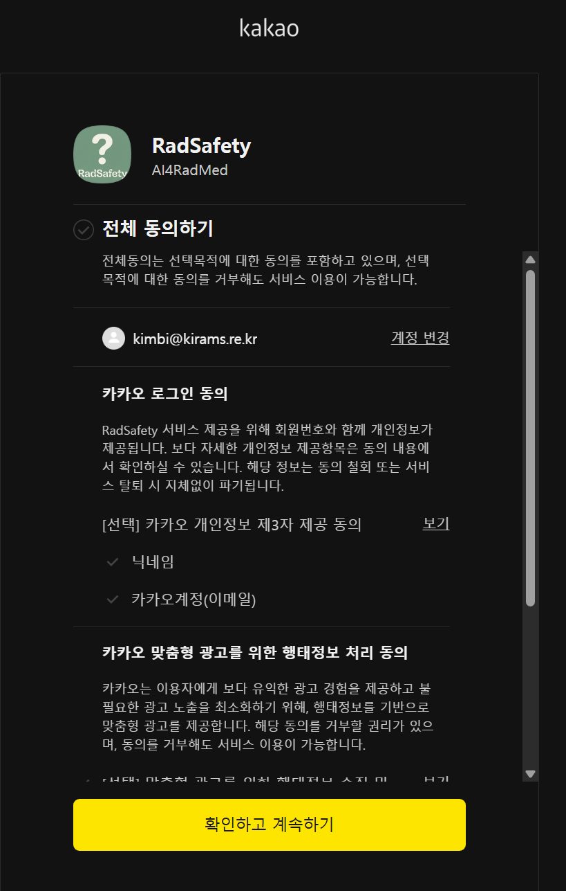

# 시스템 유지보수 런북 (Maintenance Runbook)

이 문서는 RadSafety-PWA 시스템의 기술적 유지보수 및 긴급 운영 절차를 정의합니다. 애플리케이션 화면(UI)에서 제공하지 않는 **데이터베이스 직접 조작(SQL)** 및 **인프라 관리** 작업을 안전하게 수행하기 위한 지침입니다.

---

## 1. 사용자 계정 관리

### 1-1. 사용자 완전 삭제 (Hard Delete)

> [!CAUTION]
> **현재 브라우저에 로그인된 계정을 삭제할 경우 주의**
> 삭제 직후 브라우저에는 '유령 세션'이 남게 되어, 앱이 존재하지 않는 사용자의 데이터를 요청하며 무한 루프나 DB 에러(외래키 제약조건 위반)를 일으킬 수 있습니다.

**안전한 삭제 순서:**

1.  **로그아웃**: 삭제하려는 계정이 브라우저에 로그인되어 있다면 반드시 먼저 **로그아웃**을 수행합니다.
2.  **Supabase Auth 관리**: 콘솔에서 사용자를 삭제합니다.
3.  **데이터베이스 정리**: SQL Editor에서 다음 쿼리를 실행하여 관련 데이터를 수동으로 정리합니다. (외래키 설정에 따라 자동 삭제될 수 있으나 확인 권장)
4.  **브라우저 초기화 (선택)**: 만약 로그아웃을 잊고 삭제했다면, 브라우저 개발자 도구(F12) -> Application -> **Clear Site Data**를 실행하여 남은 인증 토큰을 강제로 제거해야 정상적인 이용이 가능합니다.

```sql
-- 사용자 프로필 및 알림 데이터 정리
DELETE FROM public.profiles WHERE id = '공유받은-사용자-ID';
DELETE FROM public.notifications WHERE user_id = '공유받은-사용자-ID';
```

### 1-2. 카카오 계정 생성 및 자가 치유(Self-healing) 테스트

신규 가입 흐름이나 데이터 누락 시 복구 로직이 정상 작동하는지 확인하는 절차입니다.

#### A. 완전 신규 가입 테스트 (E2E)

1.  **로그아웃**: 현재 브라우저 세션을 종료합니다.
2.  **Supabase Auth 유저 삭제**: Supabase 콘솔 -> Authentication -> Users에서 해당 카카오 이메일 계정을 삭제합니다.
3.  **카카오 앱 연결 해제 (선택)**: 카카오톡 설정 -> 카카오계정 -> 연결된 서비스 관리 -> 'RadSafety' 선택 후 **연결 끊기**를 수행합니다. (동의창부터 다시 확인하려는 경우)
4.  **다시 로그인**: 서비스 접속 후 카카오 로그인을 진행하여 `auth.users`와 `public.profiles`에 데이터가 정상 생성되는지 확인합니다.

pc에서 최초접속하여 ㅋ

#### B. 프로필 데이터 자가 치유 테스트

사용자 인증(Auth)은 유지된 채로 DB의 프로필 정보만 소실되었을 때, 시스템이 이를 감지하고 자동으로 복구하는지 테스트합니다.

1.  **DB 프로필 삭제**: SQL Editor에서 본인의 `profiles` 로우만 삭제합니다.
    ```sql
    DELETE FROM public.profiles WHERE login_email = '내-카카오-이메일';
    ```
2.  **새로고침**: 앱으로 돌아와 페이지를 새로고침(또는 재접속)합니다.
3.  **결과 확인**: `auth-handler.ts`의 `performSelfHealing` 로직에 의해 프로필이 자동 재생성되는지 확인합니다.

### 1-3. 관리자 권한 강제 부여

애플리케이션 내에서 관리자 설정이 불가능할 경우, DB에서 직접 특정 이메일 사용자를 관리자로 지정합니다.

```sql
UPDATE public.profiles
SET is_admin = true
WHERE login_email = 'target-user@email.com';
```

---

## 2. 데이터 유지보수 및 장애 복구

### 2-1. 지적/권고사례 데이터 초기화 (신중히 실행)

테스트 데이터를 삭제하고 `content` 컬렉션의 초기 데이터만 남기고 싶을 때 사용합니다.

```sql
-- 모든 지적사항 삭제 (주의: 복구 불가능)
TRUNCATE TABLE public.findings_recommendations CASCADE;
```

### 2-2. 알림 발송 실패 내역 확인

푸시 알림이 정상적으로 수신되지 않는 경우, 알림 테이블의 생성 로그를 확인합니다.

```sql
SELECT * FROM public.notifications
ORDER BY created_at DESC
LIMIT 50;
```

---

## 3. 인프라 및 서비스 관리

### 3-1. 환경 변수(Environment Variables) 관리

Vercel 배포 환경과 Local 환경(` .env`)의 변수를 일치시켜야 합니다.

- **주요 변수**:
    - `SUPABASE_SERVICE_ROLE_KEY`: 서버 사이드 관리자 작업용 (유출 주의)
    - `PUBLIC_VAPID_KEY` / `PRIVATE_VAPID_KEY`: 웹 푸시 인증용

### 3-2. 웹 푸시 VAPID 키 교체 절차

보안 사고로 인해 키를 교체해야 하는 경우:

1.  서버에서 새로운 VAPID 키 쌍을 생성합니다.
2.  Vercel 및 `.env`의 `PUBLIC_VAPID_KEY`, `PRIVATE_VAPID_KEY`를 업데이트합니다.
3.  **주의**: 키가 바뀌면 기존에 알림을 구독했던 모든 사용자는 다시 '구독 허용'을 눌러야 알림을 받을 수 있습니다.

---

## 4. 비상 점검 리스트

시스템 장애 의심 시 다음 서비스 상태 페이지를 먼저 확인합니다.

- **Vercel Status**: [https://www.vercel-status.com/](https://www.vercel-status.com/)
- **Supabase Status**: [https://status.supabase.com/](https://status.supabase.com/)
- **Resend Status (Email)**: [https://resend.statuspage.io/](https://resend.statuspage.io/)

---

## 5. 정기 점검 사항 (Quarterly)

- [ ] **API Key 보안**: 불필요하거나 노출된 API 키가 없는지 확인 및 갱신.
- [ ] **DB 스토리지**: 파일 스토리지(Storage) 용량 및 비정상 파일 점검.
- [ ] **의존성 보안**: `npm audit`을 통해 보안 취약점이 있는 라이브러리 업데이트.
