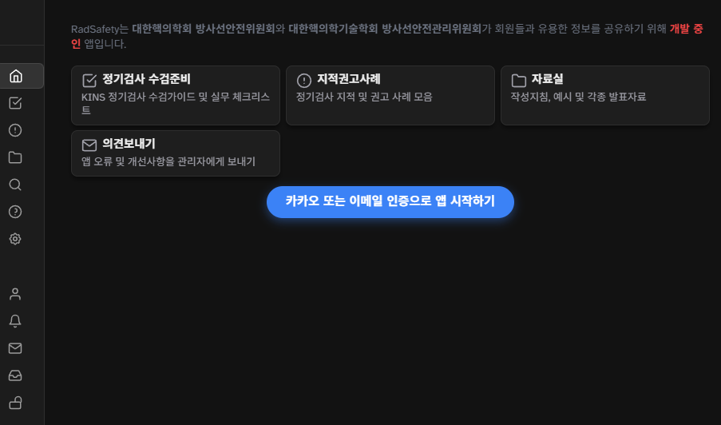
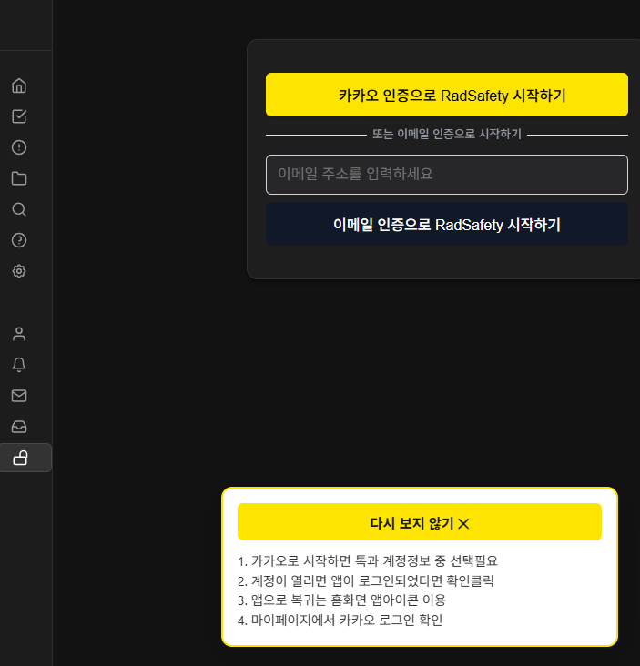
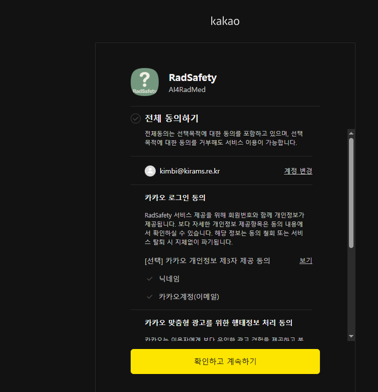
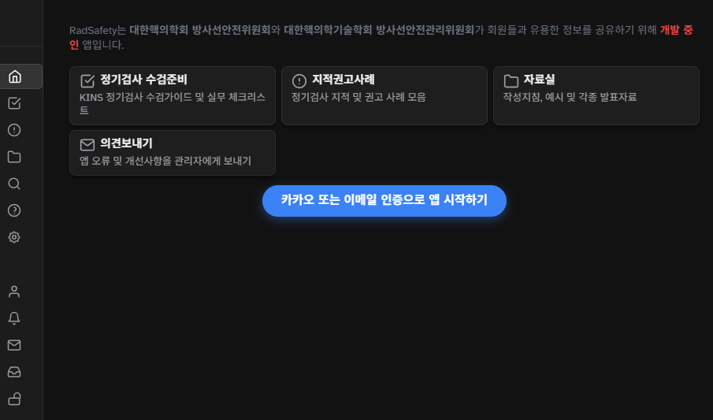
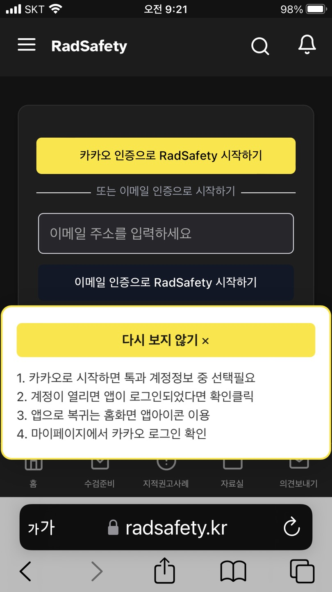
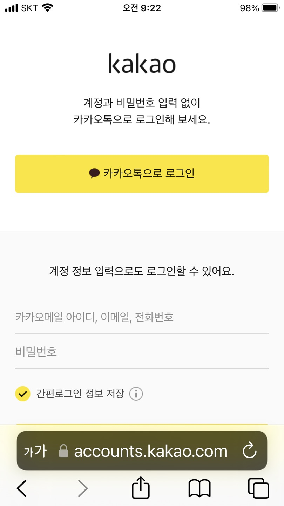
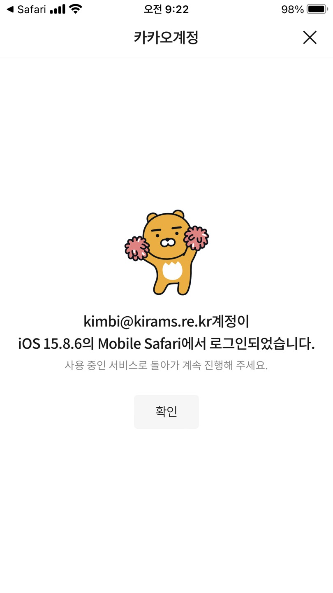
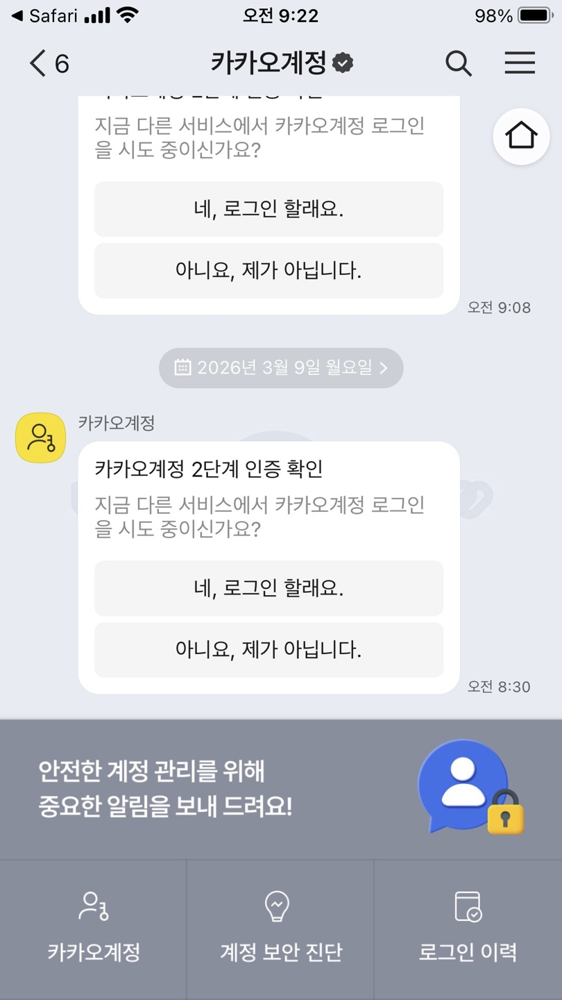
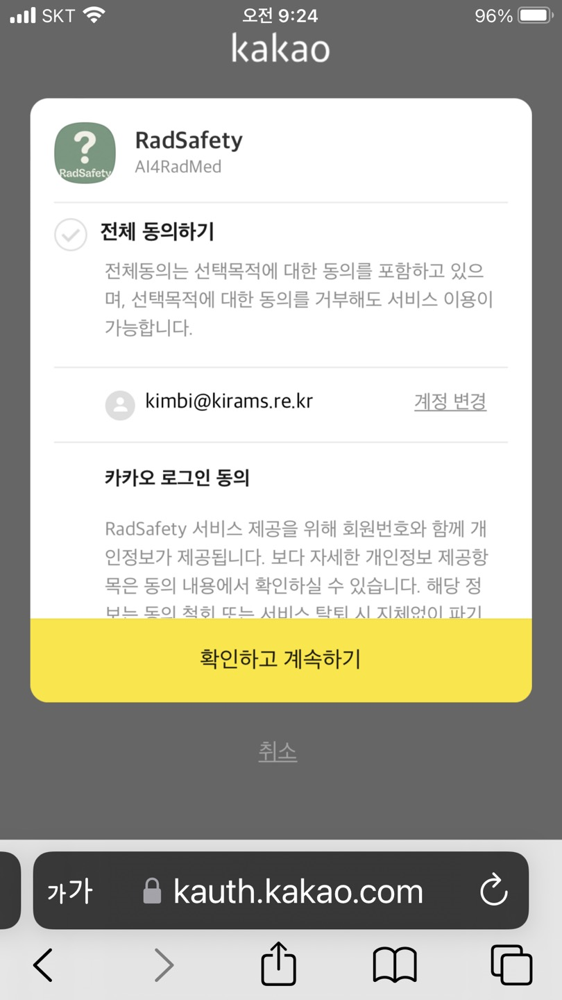

# PC에서 접속하기

1. [최초접속화면]은 아래와 같습니다.
    2.[카카오 또는 이메일 인증으로 앱 시작하기]를 클릭하면 아래의 화면으로 전환됩니다.
   
2. [카카오 인증으로 RadSafety 시작하기]를 클릭하면 아래의 화면으로 전환됩니다.
    - 여기에서 [전체 동의하기]를 선택하면
   "[선택] 카카오 개인정보 제3자 제공 동의"아래의 - 닉네임 - 카카오계정(이메일)
   [선택] 맞춤형 광고를 위한 행태정보 수집 및 이용 동의
   [선택] 맞춤형 광고를 위한 행태정보 제3자 제공 동의
   모두가 선택이 됩니다. - [전체 동의하기]를 선택하지 않고
   "[선택] 카카오 개인정보 제3자 제공 동의"아래의 - 닉네임 - 카카오계정(이메일)
   만 선택해서 [동의하고 계속하기]를 진행해도 됩니다. 하지만 카카오계정(이메일)은 필수항목이므로 반드시 입력해야 합니다.

3. [동의하고 계속하기]를 클릭하면 아래의 화면으로 전환됩니다.
   

#2 스마트폰에서 접속하기

1. [최초접속화면]은 아래와 같습니다.
   
2. [카카오 인증으로 RadSafety 시작하기]를 클릭하면 아래의 화면으로 전환됩니다.
   
3. [카카오톡으로 로그인]을 클릭하면 아래의 화면으로 전환됩니다.
   
4. [확인]을 클릭하면 아래의 화면으로 전환됩니다.
    - 하지만 시간을 자세히 보시면 카카오계정 2단계 인증 확인은 단순히 카카오계정의 마지막 활동을 부여주는 것으로 카카오를 이용한 인증과는 무관한 것입니다.
5. 반드시 사파리를 클릭해야 하며 아래의 카카오동의하기 화면이 나옵니다. 반드시 사파리를 클릭해야 하면 만약 홈화면의 바로가기를 클릭해도 오류가 발생합니다.
   
6. [확인하고 계속하기]를 진행하면 마이페이지가 로딩되면서 카카오를 이용한 인증은 마무리 됩니다.
